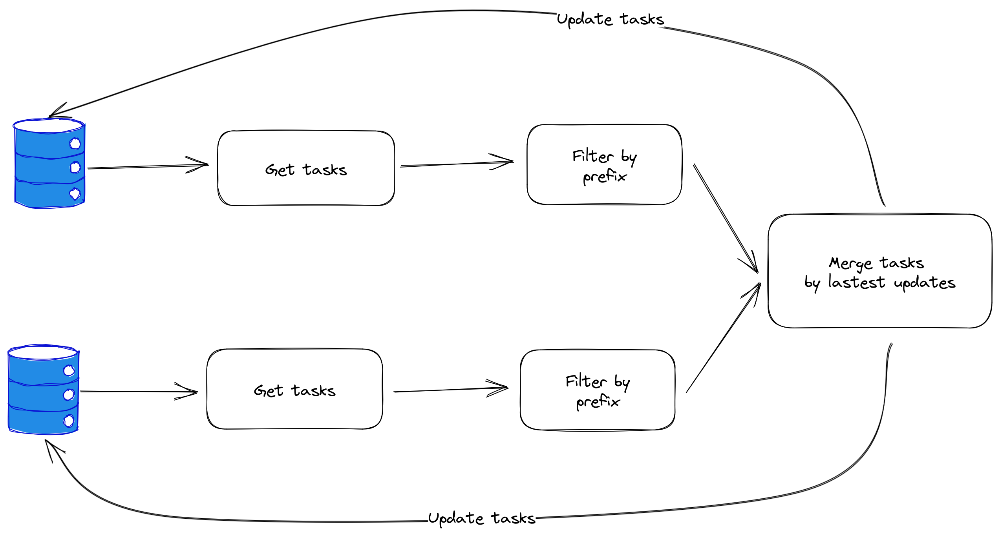

## Shared Google tasks

### Why?

- To share google tasks between people

### What?

- using the prefix of a task to determine shared tasks

### Flow

- merge flow
    - get tasks -> build map
    - compare by updated to get the lastest state of tasks
        - is completed
        - is deleted
        - due datew

- Merge tasks strategy
    - Get tasks from the past 7 days till now from both users
    - for each user, build a task map using the title of each task
    - Cons
        - Same title tasks? -> Skip for now

### Roadmap

- [ ] Deploy
- [ ] Build write client
    - [ ] Update tasks
- [ ] Merge tasks
- [x] Filter by prefix
- [x] Build read client
    - [x] Get task list
    - [x] Get tasks
### Refs:

- https://docs.rs/google-tasks1/latest/google_tasks1/
