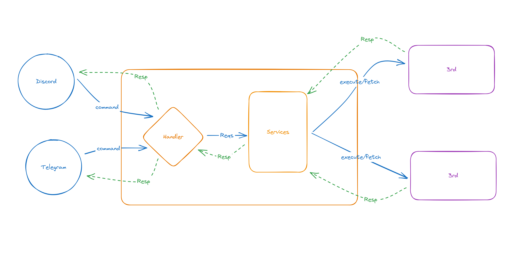

# **Wall-E project**

> a bot to support daily life tasks through Slack/Telegram commands

## **Design**

## **Features**

### **Balance tracking**

- Why?: To manage the balances (loan/deposit) of 2 entities, with 2 different currencies (units)
- How?: Receive the command from telegram & store the information in Google Sheet
- Details
    - Command:
        - /add-balance [entity] [name] [operation1 (+/-)] [amount1] [unit1], [operation2 (+/-)] [amount2] [unit2]
        - /show-balance: current balance of 2 entites
- Google sheet format:

DATE     | Entity   | Name      | Balance (unit1) | Balance (unit2) |
---------|----------|-----------|-----------------|-----------------|
 A1      | B1       | C1        | D1              | E1              |
 A2      | B2       | C2        | D2              | E2              |

- Implemetations:
    - [ ] Telegram client
    - [ ] Google sheet client
    - [ ] Command parser
    - [ ] Google sheet service write
    - [ ] Google sheet service read
- Telegram client: https://github.com/teloxide/teloxide
    - chat with @Botfather to create a new bot
    - name: t_wall_e_bot (t.me/t_wall_e_bot)
    - add dependencies:
        - teloxide: macros
        - log
        - pretty_env_logger
        - tokio: rt-multi-thread, macros